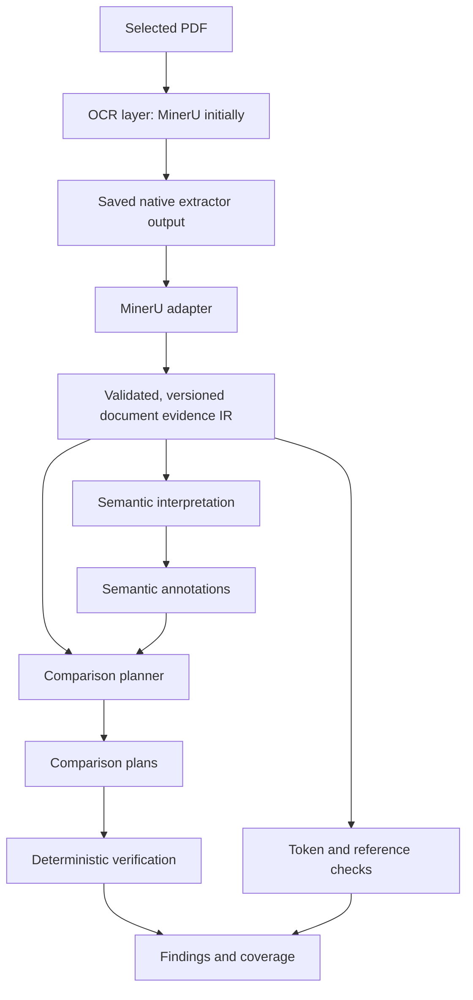

# HKEX Annual Report Audit — Automated Error Detection

A proof of concept for detecting discrepancies in HKEX annual reports, initially evaluated
against the synthetic error benchmark based on Hang Lung Properties (00101.HK).

**Design revision: 2 — reconciled 2026-09-09. Status: Milestone 0 complete; four owner-approved development inputs ready.** Objectives and constraints are fixed.
Contracts, module layout, and technical mechanisms are the proposed starting point, to be tested
through small implementation milestones. Planned paths do not imply existing code.

The initial proposal is preserved unchanged in [README.original.md](README.original.md).
See [PLAN.md](PLAN.md) for implementation milestones and acceptance criteria.
The superseded design and plan are preserved in the [dated archive](docs/archive/2026-09-09/INDEX.md).
[SCORING.md](eval/SCORING.md) owns scoring, [the format specification](eval/eval_format_spec.md)
owns evaluation records, and [the taxonomy](spec/taxonomy.yaml) owns category meanings.
These evaluation contracts are version 2.0.0. Intake and the Milestone 1 evidence layer are implemented;
semantic interpretation and detection remain to be implemented. Milestone 1’s limited native-evidence handoff was accepted on 2026-09-11: see the [review packet](eval/milestone1/README.md) and
[evidence contract](spec/evidence-contract.md). Run `make evidence-check` for portable evidence tests;
`make evidence-local-check` checks the selected native exports without PDF or raw-injector reads.

**Provisional model decision — 2026-09-18:** use Gemini 3.8 Flash as primary and DeepSeek V4.1
Flash for research-only copies of semantic queries, through OpenRouter. [Section 4](#4-model-operation-and-licensing)
owns this policy and takes precedence over overlooked Pro-only or alternative-default instructions.
Record and reconcile active contradictions; preserve historical experiment bytes and results.
Model selection is closed; runtime integration and production sufficiency remain open. See the
[reconciliation plan and rationale](docs/model-policy-reconciliation-2026-09-18.md).

## 1. Objectives and constraints

Demonstrate a complete lifecycle: ingest → interpret → verify → findings → evaluate → iterate.
Each stage must connect. The deliverable emphasizes working code, structured findings, and evidence.

- **Generalization by design.** Issuer-specific vocabulary, note mappings, and template assumptions
  belong in data. Additional issuers should extend vocabulary and reusable patterns without changes
  to check code. Any required check-code change is architectural evidence to investigate.
- **Deterministic verification first.** Code parses and computes numbers. Models interpret meaning
  and propose links; they never supply computed answers or corrected report values.
- **Model choice.** Gemini 3.8 Flash supplies primary semantic interpretation; DeepSeek V4.1 Flash
  receives the same bounded semantic queries for research only. Exact IDs and routes are in section 4.
  Both use OpenRouter (`https://openrouter.ai/api/v1`). Credentials come from `OPENROUTER_API_KEY`
  in the execution environment, never tracked files or prompts. The document extraction model
  remains a separate, replaceable choice.
- **Clean boundaries.** Extraction, interpretation, comparison planning, verification, and evaluation
  have explicit interfaces. Runtime detection has no access to benchmark answers.
- **Licensing.** Selected code, weights, and transitive dependencies must meet the project's
  prohibition on copyleft obligations requiring publication of the proprietary codebase.
- **PoC scale.** One batch application, versioned configuration, saved artifacts, and a simple
  findings table. Build only mechanisms needed to demonstrate the complete lifecycle.

Use English for code, documentation, and prompts. Explain financial terminology plainly, challenge
brittle assumptions, and expose uncertain cases rather than concealing them behind confident output.

## 2. Scope and feasibility

Six categories remain scored. Difficulty includes establishing trustworthy inputs and relationships,
not just executing arithmetic after those relationships are known.

| Category | End-to-end difficulty | Main challenge |
|---|---|---|
| `primary_statement_articulation` | Medium | Contributing rows, signs, nested totals, and balance identities |
| `internal_note_reconciliation` | Medium | Complete movements, transfers, and matrix-shaped reconciliations |
| `formatting_typography_validation` | Medium for precision | Preserving malformed tokens and separating source errors from extraction damage |
| `disclosure_reference_verification` | Low–Medium | Distinguishing dangling references from wrong references that still resolve |
| `document_wide_consistency` | Medium | Compatible entities, periods, units, and presentation bases |
| `statement_to_note_articulation` | Medium–High | Selecting the corresponding fact within a note, including ambiguous references |

`inter_note_articulation`, `table_structural_integrity`, and `textual_semantic_integrity` remain
descoped: no dedicated detector or effort allocation. Preserve the nine-code taxonomy; any future
descoped ground-truth records use `scoring_status: "descoped"` and match neutrally under the
scoring contract. The current 48-record delivery contains no descoped injections.
Taxonomy status `active` means a valid term, not an implemented or scored detector.

Validating extraction structure remains necessary engineering; it is not a new scored detector for
structural errors in the source document.

The main risks are extraction fidelity, semantic alignment, and relationship completeness. Neither
a fixed count of check families nor a fixed number of profiles across the HK market is assumed.

## 3. Proposed architecture

The PDF/OCR arrows describe upstream provenance, outside the current execution boundary.
Current execution starts at explicitly selected saved native output or IR. These are modules and
persisted records within one application, not separate services.

| Artifact | Contents | Boundary |
|---|---|---|
| **Document evidence IR** | Extracted text, logical cells, layout evidence, source locations, extraction limitations | No accounting conclusions or source corrections |
| **Semantic annotations** | Concepts, roles, contexts, relationship candidates, supporting source references | No rewritten amounts or computed answers |
| **Comparison plans** | Operand references, permitted operation, prerequisites, relationship justification, tolerance policy | No arbitrary generated code or numeric answers |

Each transformation preserves its inputs. A finding is traceable through its plan and annotations
to the original extraction and PDF. Parser output records what was extracted; it does not guarantee
that extraction matches the page.

### 3.1 Extraction ownership and evidence contract

The audit team owns the contract, validator, examples, and downstream modules. The extraction team
owns engine selection, self-hosting/adaptation, parser dependencies, and the conforming adapter.
Both teams collaborate on the first adapter so the handoff is concrete.

**Decision confirmed 2026-09-10:** build the first document evidence IR from the supplied MinerU
outputs. The OCR layer produces native artifacts; an adapter translates them into a versioned,
validated, persisted evidence IR. The main audit pipeline consumes that IR as its input contract.
MinerU-specific fields and dependencies stay in the extraction/adapter layer. The IR represents
extracted evidence, separately from semantic annotations, comparison plans and evaluation records.

Develop and replay the main pipeline against saved IR without installing or rerunning MinerU.
Current scope excludes OCR engine installation, execution, adaptation and hosting. Use the existing
clean and corrupted MinerU outputs as separate selected inputs; neither run may access the other
variant as an answer source. Historical checkpoint/settings gaps remain recorded limitations, not
prerequisites for building the detector from fixed artifacts. New extraction output creates a new traceable IR revision; it must pass
contract and native-to-IR preservation checks before replacing a development input. Missing evidence
remains explicit and dependent checks abstain.

**Source-of-truth boundary (2026-09-10):** selected MinerU output is the source of truth for
extracted evidence in this PoC; saved IR must preserve it faithfully. This is an input authority,
not a claim that OCR is accurate or the report is financially correct. Validate native structure,
literal preservation and audit relationships; do not assess OCR quality against raw PDFs or repair
extracted values from them. Do not open, parse or render raw PDFs during current development,
review or runtime. Unresolved native evidence remains unknown. Runtime accepts explicitly selected
native artifacts or saved IR and rejects PDF inputs. Legacy Milestone 0 intake/review tools that
read or hash PDFs are outside this workflow and must not be run for current development.

This selects MinerU's existing outputs for the first adapter; any future deployment of an engine requires
acceptance of its exact build, weights, dependencies and licensing. Start with one adapter, save native
output unchanged, and inspect samples from another engine before claiming contract portability.

The minimum evidence contract includes:

- Document hash, schema version, page identities/dimensions, and source references.
- Text blocks and tables with logical cell IDs, row/column positions, recovered spans, captions,
  and headers. Preserve page furniture needed for reference and consistency checks.
- Original extracted text, including malformed tokens. Distinguish blank, dash, explicit zero,
  missing content, and failed recognition.
- Available localization and explicit per-region limitations. Define coordinate origin, units,
  rotation, physical page indexing, and printed page labels separately.
- A manifest: engine/backend, model revision, settings, adapter version, input/output hashes,
  and rendering or native-text extraction details relevant to replay.

Cell boxes, character boxes, fonts, and visual hierarchy are optional capabilities. Never invent
them to satisfy the schema. An unresolved table grid remains a countable unresolved region;
dependent checks abstain. Do not discard failed regions and shrink coverage denominators.

A logical table with table-level localization may support arithmetic; a glyph-sensitive check may
require finer evidence. Every check declares its actual needs. Contract conformance and extraction
accuracy are measured separately.

Preserve supplied native text and inert image references where available; do not open PDFs or
load PDF-derived review text/images in the current native-only workflow. Adapters translate evidence without
repairing numbers or inferring accounting relationships. Predicted layout is identified as such.

### 3.2 Semantic interpretation

Code parses numeric tokens with exact decimal arithmetic and stores normalized values separately
from raw text, with parse status and rounding precision. Ambiguous tokens remain unresolved.

A financial fact is a source occurrence with interpreted context:

**Concept + entity/consolidation scope + period + unit/scale + presentation basis.**

Distinguish an instant from a duration, group from parent-company figures, original from restated
comparatives, and gross from net amounts where relevant. Unknown context stays unknown. Preserve
separate occurrences of apparently identical facts so disagreements cannot be deduplicated away.

Use deterministic parsing and context-aware lexicon lookup first. Gemini 3.8 Flash resolves remaining
roles, concepts, and links through constrained identifiers and labels; DeepSeek V4.1 Flash receives
an independent research copy of each operational semantic query under the policy in section 4.
Only validated primary output may feed annotations and plans. Code assembles context values from
referenced evidence. Model output contains no financial amounts, computed results, or source fixes.

Prompts contain bounded evidence: table cells, caption, headers, relevant footnotes, section context,
and candidate IDs. Do not send the entire report by default. Where practical, mask amount tokens for
semantic tasks that do not need them, while retaining dates, units, and note markers.

Annotations record supporting references and their method. Validate schema, identifier membership,
and context compatibility. Schema-valid labels can still be semantically wrong.

### 3.3 Comparison planning

The planner constructs explicit relationships such as closing balance equals opening balance plus
signed movements, or a statement amount equals a particular note total in a compatible context.

Plans identify operands, operation, expected context relationships, supporting evidence, completeness,
and tolerance policy. They may consume model-proposed links but never execute model-generated code.
Code supplies permitted operators and contribution signs from validated roles and patterns.

Use reusable patterns: additive breakdown, opening-to-closing reconciliation, matrix totals,
comparative statement, and maturity schedule. Statement profiles describe expected concepts and
select patterns. Configuration must not become a store for benchmark answers, fixed cell positions,
or issuer-specific executable logic.

**Establish relationships without selecting for numerical agreement.** Do not use subset-sum search
to find a convenient grouping or amount similarity to choose a matching note fact. Comparative
agreement can corroborate a supported relationship; failure in both periods does not prove a parse
error. Not every table has comparative columns.

For statement-to-note matching: resolve the literal reference, enumerate candidates, filter by
context, and use bounded semantic selection when necessary. A separate search over indexed note
headings/concepts may propose an alternative when a reference is suspect. Preserve both the original
reference and alternative link; never silently repair the document. Ambiguous matches abstain.

### 3.4 Verification, uncertainty, and findings

Start with signed sum, equality after unit conversion, reference resolution, context compatibility,
and token-format validation. Category-specific logic determines applicable relationships and finding
classification. Token/reference checks can run directly on evidence, recording their inputs and
results through the common result contract without waiting for unrelated semantic annotations.

Use explicit prerequisite states: `resolved`, `ambiguous`, `missing_evidence`, and
`invalid_extraction`. Track execution failures separately. A relevant blocked check yields `abstained`
with a reason. Reserve `not_applicable` for genuinely irrelevant checks. Dependencies are local: a missing unit may block a cross-table comparison
without blocking a syntax check. An arithmetic mismatch does not automatically invalidate the table.

For nearest-rounded values, compare feasible value intervals. With n unit-weight addends and common
rounding step u, the conservative residual bound is `(n + 1) * u / 2`, including the total's
uncertainty. Use individual intervals for unequal precision. Record the rounding assumption and
validate it on development examples; do not widen tolerances until alerts disappear. Missing
contributors, memo rows, and gross/net differences are relationship issues, not rounding fixes.

Persist every attempted or blocked check, operands, residual/interval result, and evidence references.
Emit `checks.jsonl` for all opportunities with states `passed`, `failed`, `abstained`,
`not_applicable`, or `crashed`; link failed checks to `findings.jsonl`.
Derive `abstentions.jsonl` and a coverage summary from that ledger. A failed equation establishes an
inconsistency among its inputs; it does not by itself identify the wrong cell or the correct value.
Grouping correlated findings for review must not silently change scoring or alert counts.

## 4. Model operation and licensing

**Provisional policy approved 2026-09-18; bounded header integration implemented.** For every operational semantic
query, independently send the same bounded evidence and operation contract to these OpenRouter roles:

| Role | Exact model ID | Initial provider route | Use |
|---|---|---|---|
| Primary | `google/gemini-3.8-flash` | `google-ai-studio` | Validated interpretation for audit processing |
| Research only | `deepseek/deepseek-v4.1-flash` | `together` | Separate saved comparison; no operational influence |

The [selected-IR integration results](docs/paired-semantic-integration-results-2026-09-18.md)
record one implemented header operation, isolated role artifacts and zero-call replay. Four primary
selections match independent agent review, but all omit required unit citations; saved-IR acceptance
remains open. No numerical plans/checks/findings or full Milestone 2 exit is claimed.

The offline [header citation correction](spec/semantic-operation-1.1.md) adds conditional group
support, a bounded sibling-subtotal overlap rule and conservative associated-prose blocking.
[Versioned replay](spec/paired-semantic-attempts-1.1.md) preserves v1 through a role-scoped pinned
launcher. This implementation does not change the original 0/4 complete-support result or establish
new model behavior; semantic acceptance and Milestone 2 remain open.

The approved [presentation-partition correction](spec/header-source-analysis-1.0.1.md) updates the
host analysis to 1.0.1: recognized nested presentation wrappers remain in evidence but no longer
double-count their wrapped header partition. Earlier bindings and runtime bytes remain preserved;
see the [offline correction results](docs/semantic-citation-partition-correction-results-2026-09-19.md).

The [execution deadline revision](spec/paired-semantic-attempts-1.2.md) binds new attempts/batches
as 1.2.0 and supervises preparation through owned-process cleanup under one total ceiling.
This offline correction does not authorize live inference; see the
[correction and successor preparation report](docs/semantic-citation-deadline-correction-results-2026-09-19.md).

These routes were tested in the September 17 experiments; future live work must verify availability
and served identity. Keep the strict output contract and host ID/context validation. Schema-valid
answers may still be wrong. Preserve primary abstentions and distinguish refusals, invalid outputs
and service failures; never replace them with a research answer. No automatic model/provider fallback,
consensus, veto or promotion is authorized by this policy.

Research must not block a completed primary result or enter accepted annotations, plans, findings
or primary caches. Persist independent hash-bound completion records linked by query/source identity,
including failures, missing cost and served configuration. Resolve uncertain commits by read-only
replay. Bound both roles' calls, time and cost; expose incomplete research pairs. Diagnostic follow-ups
are separate research, not recursively mirrored operational queries. Runtime receives no evaluator
keys, other-model answers or diagnostic feedback. Source-supported evaluation remains independent:
Gemini is the primary interpreter, not ground truth, and agreement is not accuracy.

The [dated reconciliation](docs/model-policy-reconciliation-2026-09-18.md) closes model selection and
sets out integration checks, including proving research-output changes cannot alter audit results.
It does not complete the pipeline, validate real-IR accuracy or set business error budgets.

Record the actual revision where exposed, provider, request settings,
prompt/schema versions, and available serving details. A mutable alias is not an immutable checkpoint.
If the provider cannot pin or identify a revision, record the limitation and resolve reproducibility
before treating deployments as equivalent.

Use supported schema-constrained output, validation, bounded retries, and failure records. Temperature
zero is a useful setting, not a reproducibility guarantee. Cache accepted responses using complete
input/context, model identity, prompt/schema, and configuration hashes. Keep response caches separate
from reviewed lexicon entries. Evaluation runs never update the lexicon.

Keep model roles configurable behind a bounded interface. Current semantic work is API-only;
local hosting, weight downloads and internal-serving parity studies are outside scope. A future
provider or model change requires separately frozen evidence; training remains outside this PoC.

Review licenses for selected code, weights, backends, and installed transitive dependencies.
Checks should use normalized license identifiers and explicitly handle unknown/unapproved entries;
exact matching against only `GPL;AGPL;LGPL` is insufficient. A module or process boundary does not
by itself establish license compliance.

## 5. Evaluation and generalization evidence

Implement [SCORING.md](eval/SCORING.md) and [the format contract](eval/eval_format_spec.md),
both version 2.0.0. They supersede the old scoring/format rules explicitly; do not compare scores
across contract versions as if the metric were unchanged.

### Delivered evidence and remaining intake

The supplied corpus is one Chinese-language Hang Lung Properties FY2025 report (228 pages),
its PDF variant containing 48 injections, and 48 metadata records: eight per scored category.
Both clean and corrupted MinerU exports are now present, reporting VLM backend version 3.2.2.
They provide richer JSON/HTML evidence for the first adapter, beyond Markdown.
Matching version strings do not establish checkpoint/settings equivalence or extraction accuracy.

Preserve the supplied files unchanged. Build reviewed canonical records and mappings separately.
`corpus/error_detail.jsonl` is immutable error-injector ground truth, locally gitignored with the
corpus. Evaluation preparation uses it to preserve and validate all 48 original IDs, literal text,
line pointers and provenance in canonical records. Evaluation uses reviewed canonical annotations;
raw injector descriptions alone do not establish eligibility or detectability. Never load this file
into the adapter, detector, semantic prompts or comparison planner. Gitignore is not access isolation.
Milestone 0 has created mappings, manifests and frozen groups/splits; 44 records still await detailed
review. No magnitude sweeps, reviewed negative collection or independent holdout exist.

The clean export is sufficient to start designing the evidence contract. Both exports permit
independent clean/corrupted adapter development using the correspondence evidence already recorded
in Milestone 0. Check preservation against native artifacts only; do not perform new raw-PDF
inspection or OCR quality review. Historical PDF review remains historical evidence.

| Evaluation mode | What it establishes |
|---|---|
| fixture | Stage behaviour on reviewed evidence, contexts and plans |
| frozen_ir | Downstream behaviour under fixed extraction artifacts |
| pdf_end_to_end | Behaviour of the recorded PDF/extractor/adapter/audit configuration |

Extraction may run separately under the extraction team's ownership, provided its inputs and
configuration are attested and frozen. Fixture annotations must not replace generated inputs in
end-to-end results. Use a statement, roll-forward, merged/continued table, note match, token/reference
cases and deliberate ambiguity for the first development examples.

### Isolation, measures and publication

Group physical sites by shared relationships, propagation and interacting injections before splitting
by split_group_id, following the scoring contract. Keep held-back labels and counterpart-derived
operands out of prompt, lexicon and plan development. Record prior exposure: this bundle has already
been inspected and cannot later be described as never seen.

Runtime receives only explicitly selected inputs. The raw error_detail.jsonl beside the PDFs is
ground truth too; blocking imports from eval/ alone is insufficient. Never use clean values to
repair the corrupted document. PDF-stage evaluation requires verified clean/corrupt extraction
provenance; Markdown/IR injections do not test OCR.

- Report L1 recall separately for above_tolerance, boundary and non-numeric errors.
  within_tolerance is a stretch diagnostic; unknown assessments block headline publication.
- Report extraction/interpretation coverage and executed, abstained and crashed opportunities,
  retaining unresolved regions and failed stages in the inventory.
- Match category-neutrally, one-to-one, maximizing match cardinality before location specificity.
  Category accuracy, cell localization and culprit attribution are separate diagnostics.
- Measure all emitted clean alerts per 100 pages, including duplicates. This is reviewer workload,
  not precision; display grouping cannot lower the count.
- Bootstrap split groups, preserving their sites and records. Report n_records, n_sites and
  n_split_groups; one issuer provides no estimate of market-wide generalization.

Headline recall remains null/UNGATED until canonical intake, literals/leakage checks, the six
invariance tests and a complete clean run within the frozen alert budget pass. ALERT_BUDGET and
RUNTIME_BUDGET remain unset; owners must date and fix them before scored runs.

Invariance covers note renumbering, entity renaming, unit rescaling with preserved rounding
precision, negative-number style, lexicon synonyms, and independent-note reordering.
Compare mapped structured claims with multiplicity, using the scoring contract's category exemptions.
Label each test's layer; an IR transformation does not demonstrate extraction invariance.

Replay frozen extraction and accepted semantic responses for deterministic downstream comparison.
Fresh OCR/model calls are separate sensitivity experiments, not interchangeable replay.
A few second-issuer tables and randomized synthetic cases can expose assumptions without building
a market-wide corpus. Measure extension work and record any required check-code changes.

## 6. Repository organization and ownership of contracts

Existing authoritative paths:

~~~text
README.md                       # current design and constraints
PLAN.md                         # current implementation milestones
README.original.md              # historical initial proposal
spec/taxonomy.yaml              # single runtime-safe nine-code vocabulary
schemas/taxonomy.schema.json     # vocabulary schema
eval/SCORING.md                  # scoring contract
eval/eval_format_spec.md         # canonical evaluation-data contract
corpus/                         # unchanged supplied inputs, including raw ground truth
tools/eval-format-tools/         # implemented version-2 formatting, intake and validation
eval/records/                   # canonical intake: four ready, 44 pending in current revision
eval/manifests/                 # immutable source inventory
eval/locations/                 # evaluation-only mappings, including unresolved candidates
eval/splits/                    # frozen groups, assignments and exposure
eval/reviews/                   # approval, evidence packets, closure and owned readiness
eval/negatives/PLAN.md           # benign-fixture plan; fixtures remain future work
docs/archive/2026-09-09/          # retired design, plan, evaluation docs and taxonomies
~~~

Planned modules and artifacts, created only as implementation needs them:

~~~text
pipeline/contracts/             # evidence, annotations, plans, results, validators
pipeline/adapters/              # native extractor translation only
pipeline/interpret/            # numeric parsing, context, lexicon, model labels
pipeline/plan/                  # relationship construction and validation
pipeline/verify/                # operations, local prerequisites, findings
pipeline/run.py                 # batch runner and persistence
config/                         # vocabulary, patterns, profiles, models, dated budgets
eval/negatives/                 # reviewed benign cases beyond the existing plan
harness/                        # matching, metrics and reporting
runs/<run_id>/                  # evidence, annotations, plans, checks, findings, manifest
~~~

Only adapters import extractor-specific packages. Downstream modules depend on shared contracts,
not native MinerU fields. Keep parser dependencies separately installable so downstream work can
use frozen evidence. Evaluation metadata never enters detector inputs.
Per-check capability requirements and local prerequisites do not belong in the category vocabulary.
Do not create a second six-code taxonomy, mandatory code generation, or separate services.

## 7. Implementation readiness and open decisions

**Milestone 0 is complete; Milestone 1 is accepted within R4’s qualified native-evidence scope.**
All 48 records validate, including 44 explicitly pending records. Source inventory, canonical import,
mappings, conservative grouping, frozen splits, review approval and initial isolation are implemented.
See the [current review handoff](eval/reviews/hkex-2025-48/README.md) and
[closure evidence](eval/reviews/hkex-2025-48/milestone-0-closure.json). Headline scoring remains
`UNGATED`; the single development group supplies no independent holdout.

PLAN.md and the review handoff own current implementation status. Delivery-status passages in the
scoring and format contracts describe the pre-intake baseline; those files remain unchanged because
the frozen split binds their exact hashes. Updating that snapshot requires an explicit contract revision.

Milestone 1 establishes contracts and the adapter. Milestone 2 demonstrates a small replayable
extraction-to-finding lifecycle, including a deliberate abstention, before broad category work.
It must show that relationships are selected without numerical shortcuts and that findings trace
back through plans and annotations to source evidence.

Open items have named owners and next actions in the
[readiness register](eval/reviews/hkex-2025-48/readiness.r5.json): extraction licensing/configuration
provenance and adapter capabilities; detailed review of the remaining 44 records; actual semantic-model
identity and serving configuration; benign fixtures; dated alert/runtime budgets; and later publication
gates. Supplied/exported PDF correspondence is corroborated; equivalent extraction settings remain unverified. Unknown checkpoint or injector metadata must remain unknown, with its effect on
reproducibility stated.

Re-estimate after the first complete lifecycle. The original 11–14 engineer-week package total
is historical, not a delivery commitment. Record extraction-team effort and integration delays
alongside audit-team effort.

## 8. Research informing the proposal

Sources checked during the September 2026 design review. These support design principles, not
performance claims about this benchmark.

- [MinerU output formats](https://github.com/opendatalab/MinerU/blob/master/docs/en/reference/output_files.md): backend-specific output belongs behind an adapter.
- [Docling serialization](https://docling-project.github.io/docling/concepts/serialization/): preserve cell spans instead of relying on Markdown.
- [XBRL Open Information Model](https://specifications.xbrl.org/work-product-index-open-information-model-open-information-model.html): contextual facts, without requiring an XBRL implementation.
- [XBRL Calculations 1.1](https://www.xbrl.org/guidance/adopting-calc1-1/): rounding-aware checks and incomplete contributing facts.
- [FinQA](https://aclanthology.org/2021.emnlp-main.300/): inspectable intermediate operations.
- [DocFinQA](https://aclanthology.org/2024.acl-short.42/): the difficulty of long-document financial reasoning.
- [FinCriticalED](https://arxiv.org/abs/2511.14998): financial evidence fidelity differs from lexical OCR accuracy.
- [DeepSeek API](https://api-docs.deepseek.com/), [JSON mode](https://api-docs.deepseek.com/guides/json_mode/), and [vLLM reproducibility](https://docs.vllm.ai/en/latest/usage/reproducibility/): revision tracking, output validation, and replay rather than assumed deterministic serving.
