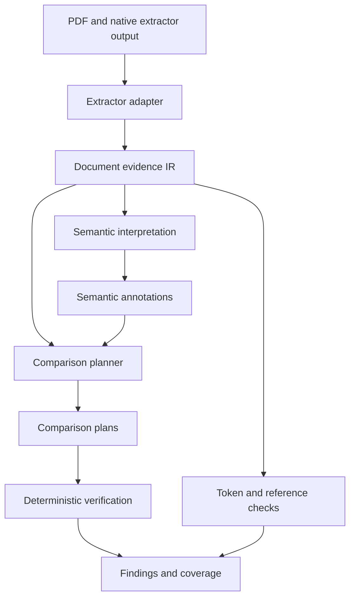

# HKEX Annual Report Audit — Automated Error Detection

A proof of concept for detecting discrepancies in HKEX annual reports, initially evaluated
against the synthetic error benchmark based on Hang Lung Properties (00101.HK).

**Status: design proposal; implementation has not landed.** Objectives and constraints are fixed.
Contracts, module layout, and technical mechanisms are the proposed starting point, to be tested
through small implementation milestones. Planned paths do not imply existing code.

The initial proposal is preserved unchanged in [README.original.md](README.original.md).
See [PLAN.md](PLAN.md) for implementation milestones and acceptance criteria.

## 1. Objectives and constraints

Demonstrate a complete lifecycle: ingest → interpret → verify → findings → evaluate → iterate.
Each stage must connect. The deliverable emphasizes working code, structured findings, and evidence.

- **Generalization by design.** Issuer-specific vocabulary, note mappings, and template assumptions
  belong in data. Additional issuers should extend vocabulary and reusable patterns without changes
  to check code. Any required check-code change is architectural evidence to investigate.
- **Deterministic verification first.** Code parses and computes numbers. Models interpret meaning
  and propose links; they never supply computed answers or corrected report values.
- **Model choice.** DeepSeek-V4-Flash handles text-based semantic interpretation, initially through
  a hosted compatible API, with a path to company-hosted deployment without architectural rework.
  The document extraction model is a separate, replaceable choice.
- **Clean boundaries.** Extraction, interpretation, comparison planning, verification, and evaluation
  have explicit interfaces. Runtime detection has no access to benchmark answers.
- **Licensing.** Selected code, weights, and transitive dependencies must meet the project's
  prohibition on copyleft obligations requiring publication of the proprietary codebase.
- **PoC scale.** One batch application, versioned configuration, saved artifacts, and a simple
  findings table. Build only mechanisms needed to demonstrate the complete lifecycle.

Use English for code, documentation, and prompts. Explain financial terminology plainly, challenge
brittle assumptions, and expose uncertain cases rather than concealing them behind confident output.

## 2. Scope and feasibility

Six categories remain scored. Difficulty includes establishing trustworthy inputs and relationships,
not just executing arithmetic after those relationships are known.

| Category | End-to-end difficulty | Main challenge |
|---|---|---|
| `primary_statement_articulation` | Medium | Contributing rows, signs, nested totals, and balance identities |
| `internal_note_reconciliation` | Medium | Complete movements, transfers, and matrix-shaped reconciliations |
| `formatting_typography_validation` | Medium for precision | Preserving malformed tokens and separating source errors from extraction damage |
| `disclosure_reference_verification` | Low–Medium | Distinguishing dangling references from wrong references that still resolve |
| `document_wide_consistency` | Medium | Compatible entities, periods, units, and presentation bases |
| `statement_to_note_articulation` | Medium–High | Selecting the corresponding fact within a note, including ambiguous references |

`inter_note_articulation`, `table_structural_integrity`, and `textual_semantic_integrity` remain
descoped: no dedicated detector or effort allocation. Preserve the nine-code taxonomy and retain
descoped ground-truth records as `scoring_status: "descoped"`. Matching detections resolve to
`NEUTRAL` under the scoring contract and enter no scoring numerator or denominator.

Validating extraction structure remains necessary engineering; it is not a new scored detector for
structural errors in the source document.

The main risks are extraction fidelity, semantic alignment, and relationship completeness. Neither
a fixed count of check families nor a fixed number of profiles across the HK market is assumed.

## 3. Proposed architecture



These are modules and persisted records within one application, not separate services.

| Artifact | Contents | Boundary |
|---|---|---|
| **Document evidence IR** | Extracted text, logical cells, layout evidence, source locations, extraction limitations | No accounting conclusions or source corrections |
| **Semantic annotations** | Concepts, roles, contexts, relationship candidates, supporting source references | No rewritten amounts or computed answers |
| **Comparison plans** | Operand references, permitted operation, prerequisites, relationship justification, tolerance policy | No arbitrary generated code or numeric answers |

Each transformation preserves its inputs. A finding is traceable through its plan and annotations
to the original extraction and PDF. Parser output records what was extracted; it does not guarantee
that extraction matches the page.

### 3.1 Extraction ownership and evidence contract

The audit team owns the contract, validator, examples, and downstream modules. The extraction team
owns engine selection, self-hosting/adaptation, parser dependencies, and the conforming adapter.
Both teams collaborate on the first adapter so the handoff is concrete.

MinerU may be the convenient initial producer if its selected version and licensing are accepted.
Its native format is not the public interface. Start with one adapter, save native output unchanged,
and inspect samples from another engine before claiming that the contract is portable.

The minimum evidence contract includes:

- Document hash, schema version, page identities/dimensions, and source references.
- Text blocks and tables with logical cell IDs, row/column positions, recovered spans, captions,
  and headers. Preserve page furniture needed for reference and consistency checks.
- Original extracted text, including malformed tokens. Distinguish blank, dash, explicit zero,
  missing content, and failed recognition.
- Available localization and explicit per-region limitations. Define coordinate origin, units,
  rotation, physical page indexing, and printed page labels separately.
- A manifest: engine/backend, model revision, settings, adapter version, input/output hashes,
  and rendering or native-text extraction details relevant to replay.

Cell boxes, character boxes, fonts, and visual hierarchy are optional capabilities. Never invent
them to satisfy the schema. An unresolved table grid remains a countable unresolved region;
dependent checks abstain. Do not discard failed regions and shrink coverage denominators.

A logical table with table-level localization may support arithmetic; a glyph-sensitive check may
require finer evidence. Every check declares its actual needs. Contract conformance and extraction
accuracy are measured separately.

Retain usable native PDF text and page images where available. Adapters translate evidence without
repairing numbers or inferring accounting relationships. Predicted layout is identified as such.

### 3.2 Semantic interpretation

Code parses numeric tokens with exact decimal arithmetic and stores normalized values separately
from raw text, with parse status and rounding precision. Ambiguous tokens remain unresolved.

A financial fact is a source occurrence with interpreted context:

**Concept + entity/consolidation scope + period + unit/scale + presentation basis.**

Distinguish an instant from a duration, group from parent-company figures, original from restated
comparatives, and gross from net amounts where relevant. Unknown context stays unknown. Preserve
separate occurrences of apparently identical facts so disagreements cannot be deduplicated away.

Use deterministic parsing and context-aware lexicon lookup first. DeepSeek-V4-Flash resolves remaining
roles, concepts, and links through constrained identifiers and labels. Code assembles context values
from referenced evidence. Model output contains no financial amounts, computed results, or source fixes.

Prompts contain bounded evidence: table cells, caption, headers, relevant footnotes, section context,
and candidate IDs. Do not send the entire report by default. Where practical, mask amount tokens for
semantic tasks that do not need them, while retaining dates, units, and note markers.

Annotations record supporting references and their method. Validate schema, identifier membership,
and context compatibility. Schema-valid labels can still be semantically wrong.

### 3.3 Comparison planning

The planner constructs explicit relationships such as closing balance equals opening balance plus
signed movements, or a statement amount equals a particular note total in a compatible context.

Plans identify operands, operation, expected context relationships, supporting evidence, completeness,
and tolerance policy. They may consume model-proposed links but never execute model-generated code.
Code supplies permitted operators and contribution signs from validated roles and patterns.

Use reusable patterns: additive breakdown, opening-to-closing reconciliation, matrix totals,
comparative statement, and maturity schedule. Statement profiles describe expected concepts and
select patterns. Configuration must not become a store for benchmark answers, fixed cell positions,
or issuer-specific executable logic.

**Establish relationships without selecting for numerical agreement.** Do not use subset-sum search
to find a convenient grouping or amount similarity to choose a matching note fact. Comparative
agreement can corroborate a supported relationship; failure in both periods does not prove a parse
error. Not every table has comparative columns.

For statement-to-note matching: resolve the literal reference, enumerate candidates, filter by
context, and use bounded semantic selection when necessary. A separate search over indexed note
headings/concepts may propose an alternative when a reference is suspect. Preserve both the original
reference and alternative link; never silently repair the document. Ambiguous matches abstain.

### 3.4 Verification, uncertainty, and findings

Start with signed sum, equality after unit conversion, reference resolution, context compatibility,
and token-format validation. Category-specific logic determines applicable relationships and finding
classification. Token/reference checks can run directly on evidence, recording their inputs and
results through the common result contract without waiting for unrelated semantic annotations.

Use explicit prerequisite states: `resolved`, `ambiguous`, `missing_evidence`, and
`invalid_extraction`. Track execution failures separately. A blocked check yields `not_applicable`
with a reason, not a pass. Dependencies are local: a missing unit may block a cross-table comparison
without blocking a syntax check. An arithmetic mismatch does not automatically invalidate the table.

For nearest-rounded values, compare feasible value intervals. With n unit-weight addends and common
rounding step u, the conservative residual bound is `(n + 1) * u / 2`, including the total's
uncertainty. Use individual intervals for unequal precision. Record the rounding assumption and
validate it on development examples; do not widen tolerances until alerts disappear. Missing
contributors, memo rows, and gross/net differences are relationship issues, not rounding fixes.

Persist every attempted or blocked check, operands, residual/interval result, and evidence references.
Emit `findings.jsonl`, `abstentions.jsonl`, and a coverage summary. A failed equation establishes an
inconsistency among its inputs; it does not by itself identify the wrong cell or the correct value.
Grouping correlated findings for review must not silently change scoring or alert counts.

## 4. Model operation and licensing

Keep DeepSeek-V4-Flash. Record the actual revision where exposed, provider, request settings,
prompt/schema versions, and available serving details. A mutable alias is not an immutable checkpoint.
If the provider cannot pin or identify a revision, record the limitation and resolve reproducibility
before treating deployments as equivalent.

Use supported schema-constrained output, validation, bounded retries, and failure records. Temperature
zero is a useful setting, not a reproducibility guarantee. Cache accepted responses using complete
input/context, model identity, prompt/schema, and configuration hashes. Keep response caches separate
from reviewed lexicon entries. Evaluation runs never update the lexicon.

A shared interface preserves the application architecture during self-hosting. Behavioural parity
still needs a small comparison on the same semantic fixtures, accounting for checkpoint, quantization,
prompt encoding, and serving configuration. The objective is to self-host/adapt existing weights;
training a new OCR or language model is outside this PoC.

Review licenses for selected code, weights, backends, and installed transitive dependencies.
Checks should use normalized license identifiers and explicitly handle unknown/unapproved entries;
exact matching against only `GPL;AGPL;LGPL` is insufficient. A module or process boundary does not
by itself establish license compliance.

## 5. Evaluation and generalization evidence

Preserve the scoring contract referenced by the initial proposal (`eval/SCORING.md`, v1.1.0).
Confirm the delivered version at intake and implement its matching, neutrality, exemptions, and
denominators exactly. Supplemental diagnostics are separate. Any necessary contract revision must
be explicit and versioned before scored use; this design does not silently amend it.

The initial proposal reports a clean document, 54 original injections, an extended set, and benign
distractors. Verify delivery and metadata rather than assuming the bundle is ready.

| Evaluation | What it establishes |
|---|---|
| Small annotated extraction fixtures | Token fidelity, cell assignment, completeness, localization |
| Semantic and plan fixtures | Correct contexts and relationships, independently of arithmetic agreement |
| Frozen-IR runs | Downstream capability under fixed extraction inputs |
| PDF-to-findings runs | End-to-end performance of the recorded extractor and audit configuration |
| Invariance and portability probes | Controlled transformations and limited unfamiliar layouts |

Development fixtures cover a statement, roll-forward, merged/continued table, note match, and
token/reference examples. Annotated evidence or plans are diagnostic inputs only, never substitutions
for generated inputs in headline end-to-end runs.

Split at `site_id` before examining scored results. Keep magnitude sweeps, related synthetic variants,
and linked propagation cases together. Exclude held-back counterparts and ground-truth operand lists
from prompt development, lexicon construction, and hand-authored comparison plans.

Record `injection_stage`: a Markdown/IR injection does not test OCR. PDF/image injections must be
visible in the rendered source. Re-extract clean and corrupted documents with identical recorded
configurations for end-to-end measurements. Never use a clean value to repair a corrupted one.

### Measures and publication gates

- Recall across six categories, separated into `above_tolerance`, `boundary`, and `within_tolerance`
  bands under the contract. Per-category recall remains diagnostic.
- Coverage: extraction, context/label resolution, lexicon hits, planned relationships, attempted
  checks, and blocked opportunities. Define denominators including unresolved regions; report with recall.
- Miss breakdown: `abstained`, `attempted`, `no_check`, `crashed`. All remain misses.
- Clean-document alerts per 100 pages, explicitly limited to the evaluated template.
- Cluster bootstrap over `site_id`, with both `n_records` and `n_sites`. Repeated magnitudes are not
  independent observations; one report does not establish uncertainty across issuers.

Withhold headline recall until the literals gate, invariance gate, and fixed `ALERT_BUDGET` pass.
Set the budget from reviewer tolerance, record its date, and freeze it before the first scored run.
Fix alert counting/grouping rules at the same time. Internal diagnostic runs may precede these gates.

Invariance covers consistent note renumbering, entity renaming, unit rescaling, negative-number style,
lexicon synonyms, and independent-note reordering. Map transformed locations, IDs, and amounts back
before comparing equivalent findings. Follow declared category exemptions. An IR transformation
tests downstream behaviour; it does not demonstrate extraction invariance.

Add a few unfamiliar second-issuer tables as a separate portability probe and randomized synthetic
tables with controlled corruptions. These expose assumptions without expanding into a market-wide
corpus. Invariance and literals lint are evidence, not proof of universal portability. Measure actual
extension work and report any required check-code changes.

## 6. Proposed repository organization

```text
README.md                       # current design
README.original.md              # unchanged initial proposal
PLAN.md                         # milestones and acceptance criteria
pipeline/
  contracts/                    # evidence, annotations, plans, results, validators
  adapters/                     # extractor-specific translation only
  interpret/                    # numeric parsing, context, lexicon, model labelling
  plan/                         # relationship construction and validation
  verify/                       # operations, prerequisites, findings
  run.py                        # batch runner and artifact persistence
config/
  lexicon.yaml                  # reviewed context-aware vocabulary
  patterns/                     # reusable table relationships
  profiles/                     # statement concepts and pattern selection
  model.yaml                    # model/provider identity and settings
  thresholds.yaml               # tolerance policies and dated budgets
eval/                           # scoring contract, source bundle, fixtures, invariance
harness/                        # matching, metrics, simple reporting
tools/                          # literals, import-boundary, and license checks
runs/<run_id>/                  # evidence, annotations, plans, results, manifest, summary
```

Only adapters import extractor-specific packages. Interpretation, planning, and verification depend
on shared contracts; runtime modules cannot import evaluation ground truth. Keep optional parser
dependencies separately installable so downstream development can run against frozen evidence.

## 7. First milestone and open assumptions

First demonstrate a complete, replayable extraction-to-finding run on representative development
cases, including a deliberate ambiguity that abstains. This tests contracts and failure boundaries
before broad category work, without reducing the final six-category scope.

Establish that the first adapter preserves enough evidence, the chosen model resolves necessary
contexts and links, and the planner selects relationships without numeric shortcuts. Re-estimate
effort using those results. The original 11–14 engineer-week package total is historical, not a
delivery promise for the revised ownership model. Extraction-team effort and integration delays
remain real costs.

Open decisions: initial extractor/version and accepted licenses; missing evidence capabilities;
confirmed scoring/bundle metadata; actual model revision and internal serving configuration;
dated alert budget; and domain review for the small fixture set.

## 8. Research informing the proposal

Sources checked during the September 2026 design review. These support design principles, not
performance claims about this benchmark.

- [MinerU output formats](https://github.com/opendatalab/MinerU/blob/master/docs/en/reference/output_files.md): backend-specific output belongs behind an adapter.
- [Docling serialization](https://docling-project.github.io/docling/concepts/serialization/): preserve cell spans instead of relying on Markdown.
- [XBRL Open Information Model](https://specifications.xbrl.org/work-product-index-open-information-model-open-information-model.html): contextual facts, without requiring an XBRL implementation.
- [XBRL Calculations 1.1](https://www.xbrl.org/guidance/adopting-calc1-1/): rounding-aware checks and incomplete contributing facts.
- [FinQA](https://aclanthology.org/2021.emnlp-main.300/): inspectable intermediate operations.
- [DocFinQA](https://aclanthology.org/2024.acl-short.42/): the difficulty of long-document financial reasoning.
- [FinCriticalED](https://arxiv.org/abs/2511.14998): financial evidence fidelity differs from lexical OCR accuracy.
- [DeepSeek API](https://api-docs.deepseek.com/), [JSON mode](https://api-docs.deepseek.com/guides/json_mode/), and [vLLM reproducibility](https://docs.vllm.ai/en/latest/usage/reproducibility/): revision tracking, output validation, and replay rather than assumed deterministic serving.
